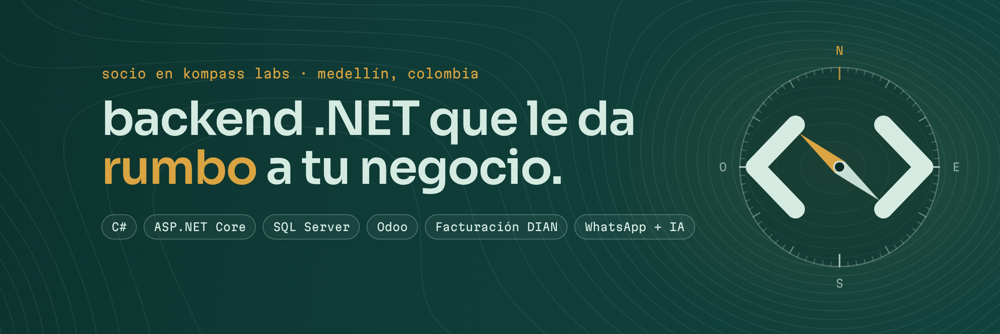

### Hola, soy Mateo Vergara

Desarrollador full-stack .NET en Medellín, Colombia. Desde 2020 construyo sistemas a la medida en [Kompass Labs](https://kompasslabs.com), donde soy socio: ERP, CRM y servicios de integración para empresas colombianas. Mi foco es llevar la IA a procesos reales (agentes de Claude y OpenAI por WhatsApp, lectura de documentos con revisión humana, asistentes con RAG) y conectar sistemas con la DIAN, Siigo, Odoo, Shopify y WhatsApp sin duplicar una sola factura.

**Abierto a trabajo remoto y proyectos freelance.**

#### Stack

C# · .NET 8 · ASP.NET Core (MVC, Web API, Minimal APIs) · Worker Services · EF Core · Dapper · SQL Server · SignalR · Razor y Blazor Server · .NET MAUI · PWA offline · Claude y OpenAI · xUnit · GitHub Actions

#### Proyectos open source

| Proyecto | Qué hace |
|---|---|
| [WhatsAppDemo](https://github.com/MateoVH/WhatsAppDemo) | Bandeja de WhatsApp con IA: Claude responde por WhatsApp (Twilio) y un asesor puede tomar la conversación con un clic, en tiempo real con SignalR. ASP.NET Core, .NET 10. |
| [OdooDemo](https://github.com/MateoVH/OdooDemo) | Conector Odoo para .NET 8: contactos, facturas y cualquier modelo por XML-RPC, con un cliente propio, sin dependencias y con pruebas y CI. |

#### En lo que he trabajado (código privado)

- **Kontable**: SaaS de facturación y nómina electrónica, RADIAN y contabilidad. Conexión directa con la DIAN construida desde cero: UBL 2.1, firma XAdES-EPES y SOAP con WS-Security, validada en el ambiente de habilitación.
- **Agente de cotización con IA por WhatsApp** para un fabricante de carrocerías (prueba de concepto): motor de fórmulas de Excel en C# y un agente de Claude con herramientas que no puede inventar precios.
- **Lectura de documentos con IA** para una siderúrgica: órdenes de compra, fotos y comprobantes con puntaje de confianza por campo y revisión humana.
- **Facturación y contabilidad** para estaciones de combustible: del POS a la DIAN y a Siigo exactamente una vez, más telemetría de tanques por MQTT.
- **ERP** para un laboratorio ambiental ISO 17025 y para una exportadora agrícola, con app móvil offline en .NET MAUI.
- **CRM y bots de WhatsApp con IA**: bandeja multiagente con copiloto, RAG sobre documentos y notas de voz.
- Integraciones con **Odoo, Shopify y Siigo** pensadas para no duplicar datos.

#### Certificaciones

- [Foundational C# with Microsoft](https://www.freecodecamp.org/certification/mateovergara/foundational-c-sharp-with-microsoft): freeCodeCamp, en alianza con Microsoft (octubre de 2026).
- [EF SET English Certificate](https://cert.efset.org/ZcGVw3): inglés B2 intermedio alto, 59/100 (octubre de 2026).

#### Contacto

[LinkedIn](https://www.linkedin.com/in/mateo-vergara-henao-972879365/) · [Upwork](https://www.upwork.com/freelancers/~0173c0937f34098cd2) · [Workana](https://www.workana.com/freelancer/d15ae7e9e376b7ccef714ecc31fd4860)

---

**English:** Full-stack .NET developer based in Medellín, Colombia. I build ERPs, CRMs and integration services with C#, ASP.NET Core and SQL Server, bring AI into real workflows with Claude and OpenAI, and integrate DIAN e-invoicing, Siigo, Odoo, Shopify and WhatsApp. Partner at Kompass Labs since 2020. Certified in Foundational C# with Microsoft (freeCodeCamp). Open to remote work and freelance projects. Spanish is my native language; English B2 Upper Intermediate (EF SET certified).
